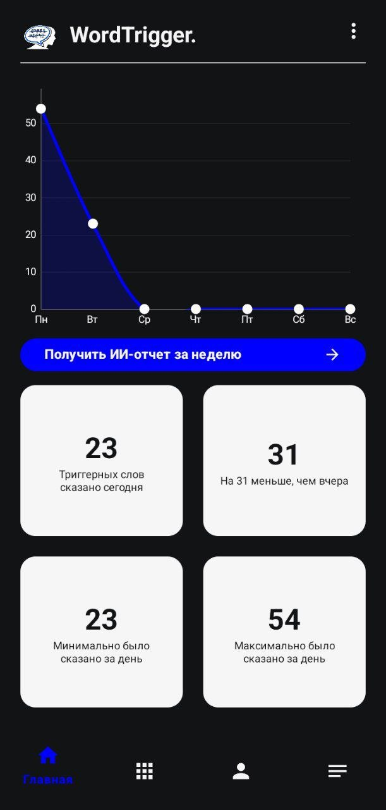
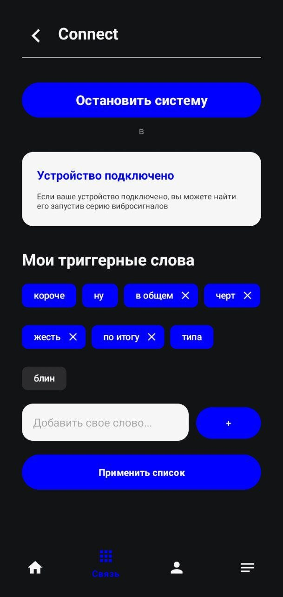
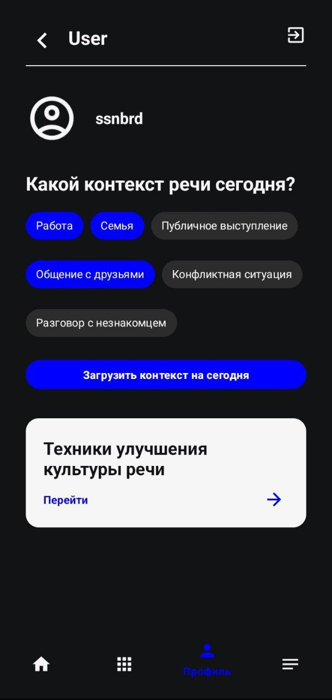
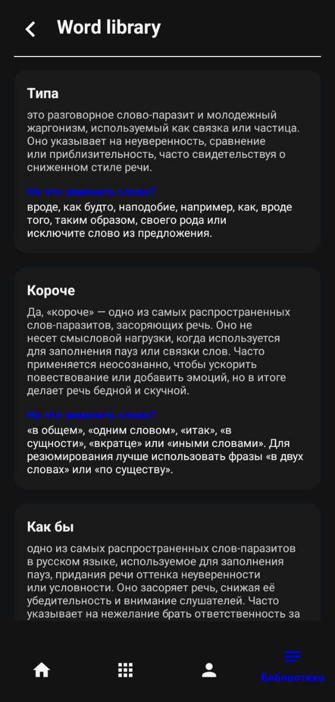
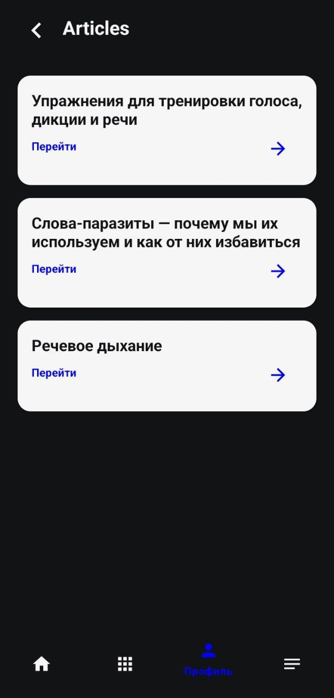
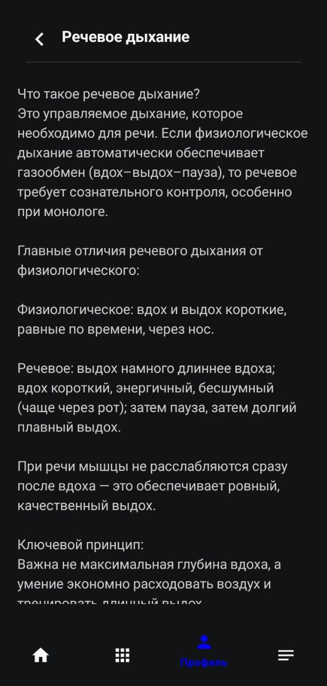
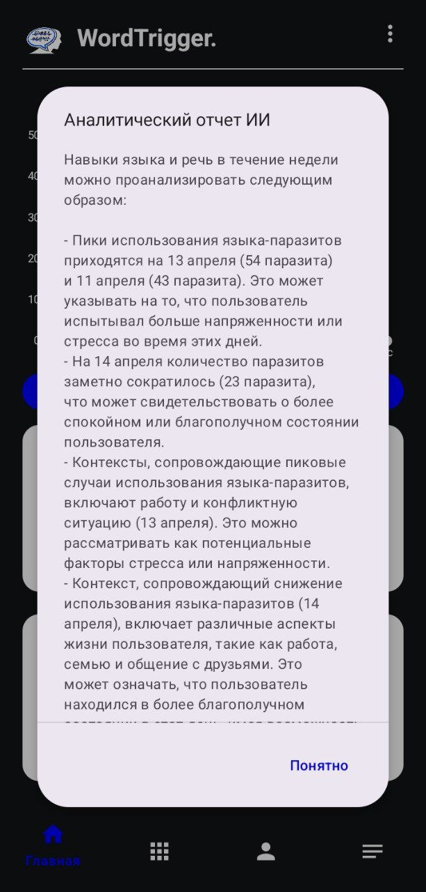

# WordTrigger
**Система контроля культуры речи с использованием носимой электроники и ИИ.**

Проект представляет собой программно-аппаратный комплекс для коррекции речи. Система в реальном времени анализирует поток аудио данных, выявляет слова-паразиты и нецензурную лексику, обеспечивая мгновенную тактильную обратную связь пользователю.

## Основные возможности
- **Гибридная обработка:** Захват звука на базе микроконтроллера ESP32-S3 и распознавание на мобильном устройстве (Vosk).
- **Фоновый мониторинг:** Работа в режиме Foreground Service (процесс не прерывается при выключении экрана).
- **Динамическая настройка:** Пользователь может сам выбирать и добавлять триггерные слова через интерфейс приложения.
- **Интеллектуальный анализ:** Использование LLM (Llama-3.1 через Groq API) для анализа речевых паттернов в различных социальных контекстах (Работа, Семья, Конфликт).
- **Статистика:** Визуализация прогресса за неделю с помощью графиков и аналитики Firebase.

## Скриншоты приложения

  
  
  
  

  
  
  

## Безопасность и ограничения
- Система ограничивает длину кастомных триггерных слов до 20 символов и запрещает ввод фраз с пробелами для корректной работы STT-движка.
- Распознавание речи (Vosk) происходит локально на устройстве, аудиопоток не сохраняется и не передается на сторонние сервера.

## Технологический стек
- **Mobile:** Java, Android Studio, Material Components 3, MPAndroidChart.
- **Backend:** Firebase Authentication, Cloud Firestore (NoSQL).
- **Firmware:** C++, PlatformIO, ESP-IDF (I2S driver).
- **Hardware:** ESP32-S3, INMP441 (I2S Microphone), Вибромотор.
- **AI/ML:** Vosk Offline STT, Groq API (Llama-3.1-8b).

## Схема подключения (Hardware)
- **Микрофон INMP441:** I2S связь (SD->13, WS->11, SCK->12).
- **Вибромотор:** Подключен через транзистор 2N2222 к GPIO 15 (защита диодом 1N4148).

## Установка и запуск
1. Склонируйте репозиторий.
2. Создайте проект в Firebase Authentication и добавьте ваш `google-services.json` в папку `app/`.
3. В `HomeFragment.java` вставьте ваш API ключ от Groq.
4. Прошейте ESP32 кодом из папки ControlCulture (PlatformIO), указав IP-адрес вашего телефона, пароль и название сети Wi-Fi.
5. Разместите модель `vosk-model-small-ru` в `app/src/main/assets/model/`.

## Разработчица
ssnbrd